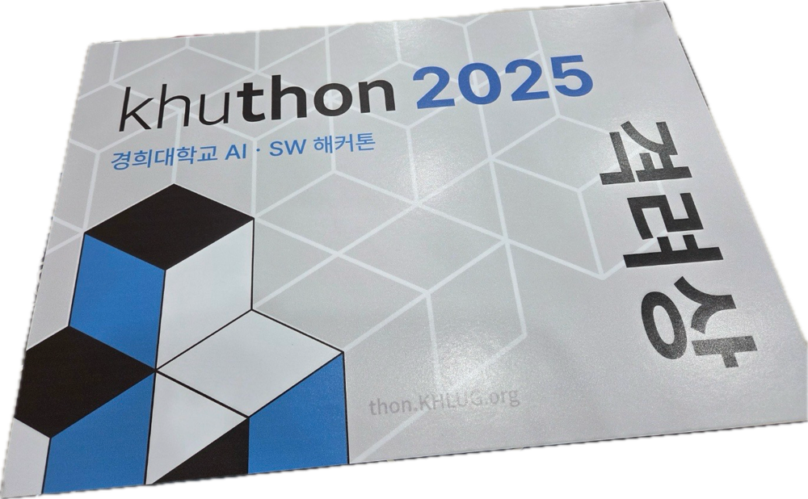

# KHUTHON

2025 쿠러스 주관 **KHUTHON**

**쿠크다스** 팀

**격려상** 수상작

# 작물PICK

- 간단한 설문 후, 사용자에게 맞는 식물 5개를 추천

- 자신의 작물 캘린더를 통해 키우는중인 작물 관리 가능

- 구글 로그인을 통해 여러 기기간 호환 가능

- 자세한 내용은 **[발표자료](/presentation.pdf)** 참고.

# 기술 스택

`dart`, `flutter`, `firebase`, `OpenAIAPI`

# Participants

- **구현** : [홍성학](https://github.com/SeonghakHong-Sch), [이윤건](https://github.com/makesense1227), [노영호](https://github.com/nyhvic]), [이동주](https://github.com/MovingJu)

- **깃허브 관리** : [이동주](https://github.com/MovingJu)